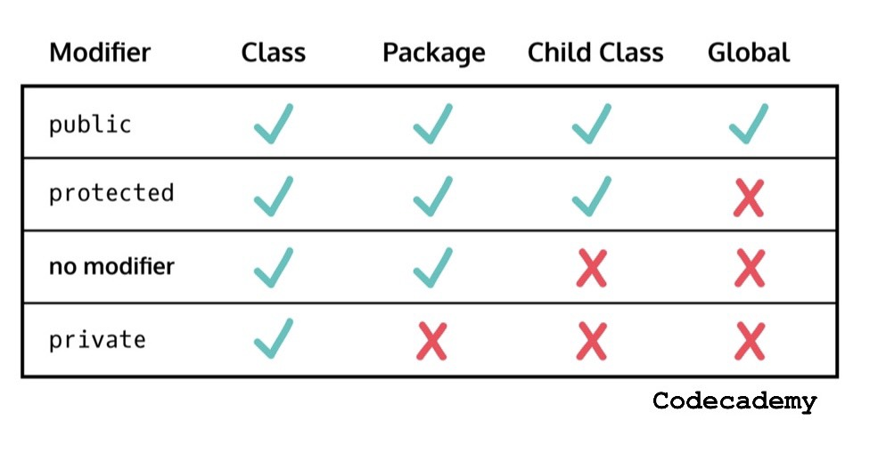

# Java-Text-Based-Program-Project
Implement a text-based program using Java language and OOP techniques.

##### GitHub repo URL of your project: https://github.com/tnathu-ai/Java-Text-Based-Program-Project
##### Video Demonstration: 

## Local Environment Setup
+ This part is intended to guide RMIT grading staff to set up their local environment to host our application correctly for grading purpose, as requested by our instructor [@TriDang](https://github.com/TriDang). Ignore this part if it is not applicable to you.
+ Please make sure that you have IntelliJ IDEA version 2021.1 installed on your system. No other software or libraries required.
+ Your work will be tested on a Windows 10 64-bit machine, using Java 16 JVM or one specified by Dr. Bao (you should ask him about this)
+ The following files are required: source code and supported files. Your source code should be organized according to your package structure
+ Don't put the git folder into your submission
+ The entry point of your program (i.e. the main() method) must be in a file named Main.java. If I cannot start from Main, I consider your program is not able to run
+ There is a README file on the root directory of your submission. It needs to contain contribution information, the GitHub repo URL of your project, and the link to your video demonstration (your video should be uploaded to YouTube - the uploaded time is used to check for late submission)
+ Contribution information: 
1/ The total increase must equal the total decrease. For example, if the team decides to increase 2 marks for person 1, there must be 2 marks decrease for someone(s) else (decrease 2 marks for person 2 OR decrease 0.5 marks for person 2 and 1.5 marks for person 3, etc.). 
2/ The maximum increase/decrease for each person is 3 (it is the mark for this rubric section). So, the maximum mark for a person on this "Team Contribution" is 6 and the minimum mark is zero. 
3/ If a person gets zero on "Team Contribution", the final mark of this person for the assignment will be zero. 
4/ If a person's contribution is zero, the mark of this person (3) cannot be used to increase other people.  
5/ The unit of increase/decrease is 0.1 marks.
An example of contribution information is
Person 1: +1
Person 2: -2
Person 3: +1
Another example
All contributions are the same
+ Compress all files as one .zip file and submit the .zip file to Canvas

## Assignment Requirements
- [Notion Display](https://first-network-e11.notion.site/Prog-JAVA-Group-Asm-199a53a3094f4ca286f713a6da9eb67a)

### 1. Three Main Parts
+ OOP design and implementation: you need to design and implement a class hierarchy to make your program flexible and easy to maintain
+ Problem-solving tasks: you need to apply control statements, algorithms, data structures, etc. to solve particular tasks
+ Video demonstration: you need to create a short video (less than 10 minutes) consisting of 2 parts. Part 1 explains how you analyze, design, and implement the system. Part 2 shows a working demo of your system

### 2. Background
The COVID-19 pandemic is becoming worse over time. Although not having a firm background in medicine and health, you want to contribute to the community in fighting this battle. By reading science articles, you know that health decision-makers need to process a lot of data to make informed and insightful decisions. Possessing several RMIT programming–related courses’ HD under your belt (even though your lecturer deliberately limits the number of HDs to just around 10%), you know that you can create an intensive data processing and analytics tool that may be beneficial to policymakers.

### 3. General Requirements
The most important weapon you need for this project is data. Fortunately, pandemic data is made available by many organizations. The data file used in this project is provided by WHO. It’s a CSV file. However, it has been deleted some unused columns. The column names are straightforward, as well as the data.
You can get the data here. (https://raw.githubusercontent.com/TriDang/cosc2081/main/assignments/project/covid-data.csv)

Note: Dr. Tri has not checked the data thoroughly. From what I learn so far, the data is sorted by country, then by date. The dates are consecutive without any gaps. If there are any missing dates (i.e., there are gaps), you can treat the missing dates as they contain all zero)

### 3. Specific Requirements
You will use the OOP paradigm to design and develop this project. There are **3 main object hierarchies** in this project.

#### a. Data: each data object has a geographic area, which can be either a country (e.g., Vietnam) or a continent (e.g., Asia), and a time range. The time range can be specified as one of the following:
+ A pair of start date and end dates (inclusive) (e.g., 1/1/2021 and 8/1/2021)
+ A number of days or weeks from a particular date (e.g., 2 days from 1/20/2021 means there are 3 days 1/20/2021, 1/21/2021, and 1/22/2021)
+ A number of days or weeks to a particular date (e.g., 1 week to 1/8/2021 means there are 8 days from 1/1/2021 to 1/8/2021)

#### b. Summary: this is the data after processed and ready to display. To create summary data, original data are grouped (b.1), a metric is chosen (b.2), and a result is calculated (b.3). 
##### Original data are grouped (b.1)
The possible ways of specifying groupings are (explanation of b.1):

No grouping: each day is a separate group.

Number of groups: a number is specified and you must divide your data into that number of groups. You need to divide your data as equally as possible. For example, if your data consist of 10 days (day 1 to day 10) and 3 groups are needed, then you can divide your data into either

|   |    |    |
|------------|-------------|-------------|
| [day 1 to day 3] | [day 4 to day 6] | [day 7 to day 10] |
| [day 1 to day 3] | [day 4 to day 7] | [day 8 to day 10] |
| [day 1 to day 4] | [day 5 to day 7] | [day 8 to day 10] |

**Note** that you can only put **consecutive days** into a group. In other words, putting day 1, day 2, and day 4 into a group is invalid.

**Number of days:** a number is specified and you divide your data into groups so that each group contains that number of days. For this grouping, if it is not possible to divide groups equally, raise an error telling the caller about that. For example, if your data consist of 10 days (day 1 to day 10) and 5 days per group are needed, you can divide your data into 2 groups. “Number of days” like 3 or 4 are invalid in this case.

##### A metric is chosen (b.2)
After specifying a grouping method, a metric is chosen. There are 3 possible metrics (explanation of b.2): positive cases, deaths, and people vaccinated.

##### A result is calculated (b.3)
Finally, users of your program can choose one of the following result types (explanation of 2.3)
+ **New Total:** total new cases/new deaths/new vaccinated people in a group.

**Note:** the vaccinated column contains the accumulated values up to a date, not new data for each date as new cases and new deaths columns. So, you can calculate vaccinated2 – vaccinated1 to get the new vaccinated after day 1 up to day 2
+ **Up To:** total cases/deaths/vaccinated from the beginning up to the last date of a group

#### c. Display: summary data is displayed to viewers. There are 2 ways to display data
##### Tabular display: 
+ Display summary data in a table. There are 2 columns: the first column named “Range” and the second column named “Value.” In the table, display a row for each group. 
+ For each group, the “Range” column shows “date1 – date2,” where date1 and date2 are the first dates and last dates of a group, respectively. If a group contains just 1 date, it shows that date only. The “Value” column of a group shows the calculated value (New Total or Up To) described above.

| RANGE  | VALUE   |    |
|------------|-------------|-------------|
| [b.1] | [b.3] |  |

##### Chart display: 
+ Display summary data in a textual chart. The chart area consists of 24 rows x 80 cols. 
+ The x-coordinate direction is left to right, and the y-coordinate direction is from bottom to top. The x-coordinate represents the groups, and the y-coordinate represents the calculated summary results. 
+ You should position the groups as equally as possible on the x-coordinate. And you should use the minimum and maximum result values to position a result on the y-coordinate linearly (**RATIO**). 
+ The left-most column should display all | (pipe) characters, while the bottom-most row should display all _ (underscore) characters. (That means you have 23 rows and 79 columns left to display data points). 
+ Each summary data point is represented as an asterisk *.
##### User interface
Your program should show a menu that lets users choose data (area and range), summary (grouping condition, metric, and way of calculation), and display (tabular or chart). Users can continue as many times as they want. They can choose to end the program when they finish.

### More specific details provided on [RMIT Canvas](https://rmit.instructure.com/courses/88189/assignments/589549) (Login with RMIT ID)
***

## Implementation

### 2. Coding styles & conventions 
#### IntelliJ IDEA
- [IntelliJ IDEA Guide](https://www.jetbrains.com/help/idea/getting-started.html)
- [Set up a Git repository](https://www.jetbrains.com/help/idea/set-up-a-git-repository.html)
- [Cloning a Project from GitHub](https://www.youtube.com/watch?v=aBVOAnygcZw)

#### Java
- [Code Conventions for the Java Programming Language](https://www.oracle.com/java/technologies/javase/codeconventions-introduction.html)
- [Google Java Style Guide](https://google.github.io/styleguide/javaguide.html)
- Kernighan & Ritchie Style

eg:
+ ***Class Name:*** (n) Student, ThuJavaClass
+ ***Interface Name*** (adj) Runable, Serializable
+ ***Constructor:*** Abc()
+ ***Variable name:*** sname, stockprice
+ ***Method:*** (v) abc(), run(), actionPerformed()
+ ***Constant:*** DENSITY, MIN_PRICE

- [Java Quick Reference](https://apstudents.collegeboard.org/ap/pdf/ap-computer-science-a-java-quick-reference_0.pdf)
- Java Class Modifiers

#### Scrum Guide
- [The 2020 Scrum GuideTM](https://scrumguides.org/scrum-guide.html)
#### Git Guide
- [Git Reference](https://git-scm.com/docs)
#### Gitflow
- [Kuri Gitflow](https://youtu.be/w8fMSsyq2u8)

### 3. Key people

- Instructor: Tri Dang, PhD. [@TriDang](https://github.com/TriDang) | [website](https://tridang.info/index.php/about/)
- Instructor: Bao Nguyen, PhD. [@baothien](https://github.com/baothien) |
- Student: Thu Tran [@tnathu-ai](https://github.com/tnathu-ai)
- Student: Nhu Nguyen [@lacnham](https://github.com/lacnham)
- Student: Linh Vu [@Linh-0v0](https://github.com/Linh-0v0)
- Student: Nhat Nguyen[@NhatNguyen3001](https://github.com/NhatNguyen3001)
***

## Grading Criteria
+ **Clean Code**: Use standard guidelines; apply consistent naming, style, and indentation; add appropriate comments, etc.
+ **Video Demonstration**: Explain clearly how the system is developed; Demonstrate exactly the system's functionalities
+ **Team Contribution**: Teams decide how much increase/decrease for each member depends on his/her contribution
+ **OOP Design**: Easy to extend; Use appropriate access modifiers; Effective code reuse; Less code duplication between classes; Single responsibility for each class, etc.
+ **User Interface & Interaction**: Users can choose different options at all steps; All steps need to be linked together naturally; Users can quit smoothly
+ **Extract Data**: Data extracted correctly (area and time range)
+ **Summary Creation**: Correctly creating summary data based on original data and grouping, metric, and required calculation
+ **Display**: Display summary data in tabular and chart formats
